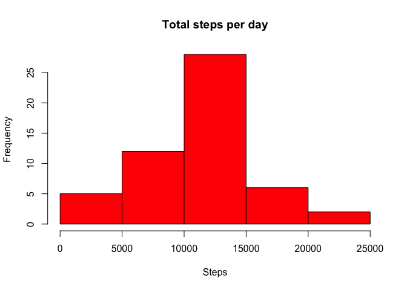
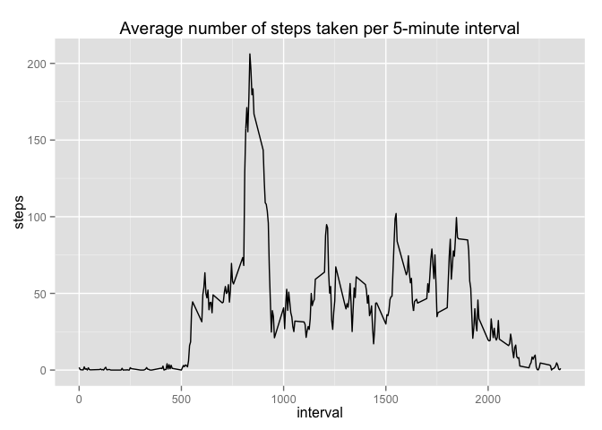
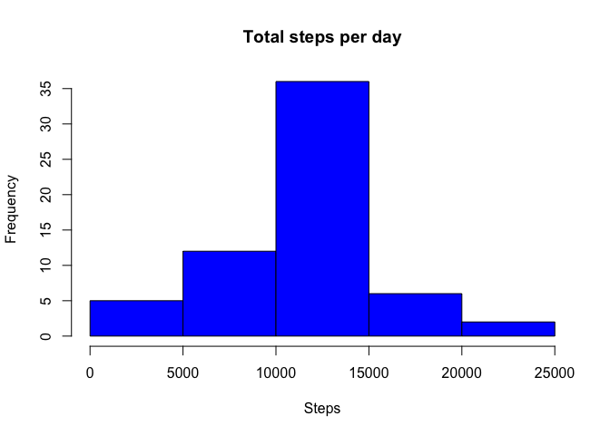
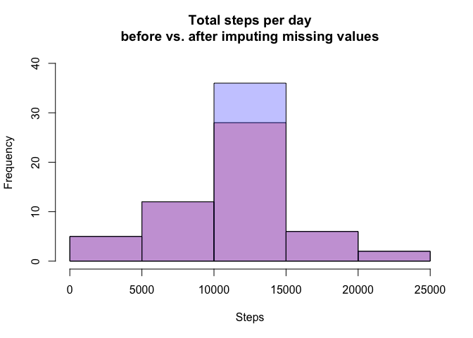
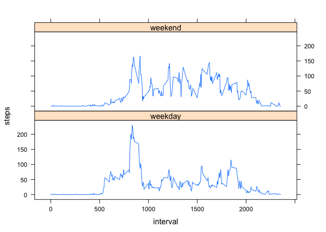

# Reproducible Research: Peer Assessment 1


```r
library(data.table, warn.conflicts = FALSE, quietly = TRUE)
library(plyr, warn.conflicts = FALSE, quietly = TRUE)
library(dplyr, warn.conflicts = FALSE, quietly = TRUE)
library(ggplot2, warn.conflicts = FALSE, quietly = TRUE)
library(lattice, warn.conflicts = FALSE, quietly = TRUE)
```

## Loading and preprocessing the data

```r
activity <- read.csv("activity.csv", colClasses=c("integer","Date","integer"))
activity$date <- as.factor(activity$date)
```

## What is mean total number of steps taken per day?

```r
act1 <- na.omit(activity) %>%
    group_by(date) %>%
    summarise(steps = sum(steps))

p1 <- hist(act1$steps, 
           main = 'Total steps per day', 
           xlab = "Steps", 
           col = "red")
```

 

```r
summarize(act1, mean(steps), median(steps))
```

```
## Source: local data frame [1 x 2]
## 
##   mean(steps) median(steps)
## 1    10766.19         10765
```

## What is the average daily activity pattern?

```r
act2 <- na.omit(activity) %>%
    group_by(interval) %>%
    summarise(steps = mean(steps))

ggplot(act2, aes(interval, steps))+ 
    geom_line()+
    ggtitle("Average number of steps taken per 5-minute interval")
```

 

```r
subset(act2, steps == max(steps))
```

```
## Source: local data frame [1 x 2]
## 
##   interval    steps
## 1      835 206.1698
```

## Imputing missing values
Create a data.frame with the mean(steps) for each interval where values are available, and a function to retrieve mean(steps) for a given interval.

```r
avg <- na.omit(activity) %>%
    group_by(interval) %>%
    summarise(mean=as.integer(mean(steps)))

impute <- function(x) { 
    if (is.na(x[1])) {
        y <- as.numeric(avg[avg[1]==as.integer(x[3]),2])
        return(y)
    }
    return(x[1])
}
```

For each measurement where steps is NA, use the impute() function to replace it with the mean(steps) from all other available measurements for that interval.

```r
sum(is.na(activity$steps))
```

```
## [1] 2304
```

```r
act3 <- activity
act3$steps <- as.integer(apply(act3, 1, function(x) impute(x)))

act3 <- act3 %>%
    group_by(date) %>%
    summarise(steps = sum(steps))

p3 <- hist(act3$steps, 
           main = 'Total steps per day', 
           xlab = "Steps", 
           col = "blue")
```

 

What are the mean and medain steps before (act1) and after (act3) imputing missing values?

```r
summarize(act1, mean(steps), median(steps))
```

```
## Source: local data frame [1 x 2]
## 
##   mean(steps) median(steps)
## 1    10766.19         10765
```

```r
summarize(act3, mean(steps), median(steps))
```

```
## Source: local data frame [1 x 2]
## 
##   mean(steps) median(steps)
## 1    10749.77         10641
```

```r
plot( p1, col=rgb(1,0,0,1/4), ylim=c(0,40), 
      main = 'Total steps per day\nbefore vs. after imputing missing values', 
      xlab = "Steps")
plot( p3, col=rgb(0,0,1,1/4), ylim=c(0,40), add=T)
```

 

## Are there differences in activity patterns between weekdays and weekends?

```r
weekdays <- subset(activity, !wday(activity$date) %in% c(1,7))
weekdays$dow <- "weekday"

weekends <- subset(activity,  wday(activity$date) %in% c(1,7))
weekends$dow <- "weekend"

act4 <- rbind(weekdays,weekends)
act4$dow <- as.factor(act4$dow)
act4$steps <- as.integer(apply(act4, 1, function(x) impute(x)))

act4 <- act4 %>%
    group_by(dow,interval) %>%
    summarise(steps = mean(steps))

xyplot(steps~interval|dow, data=act4, layout=c(1,2), type='l')
```

 
